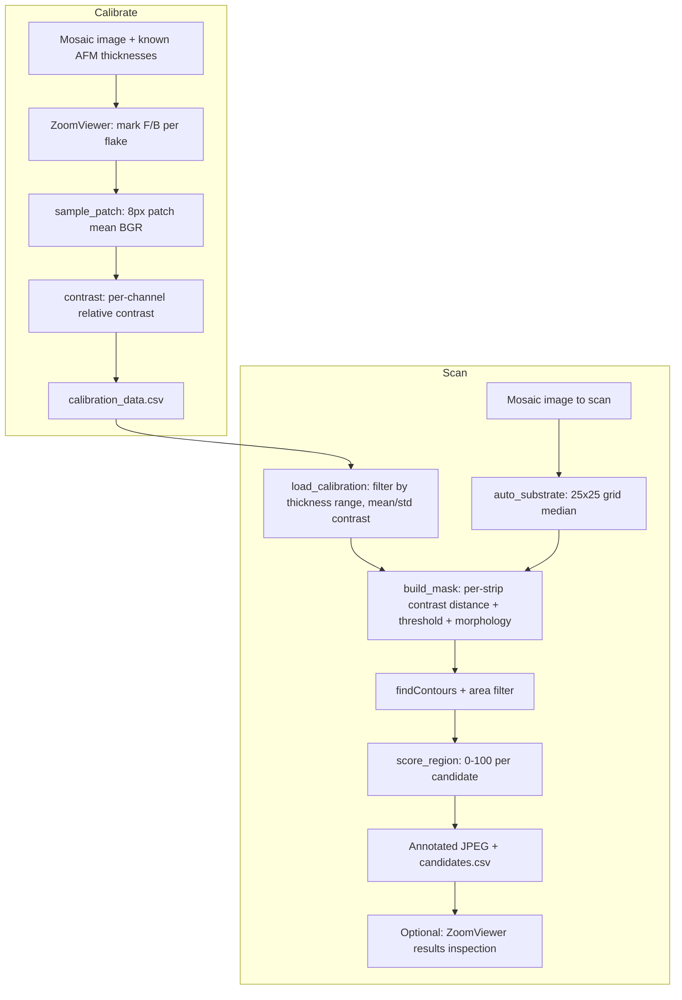

# flake-scanner (Graphene Flake Finder) Architecture Documentation

## 1. How to Read This Document

This document describes the architecture of `flake-scanner`, a Python CLI
tool built for a condensed matter physics lab to automate detection of
usable 2D-material flakes in microscope images. It is intended for
contributors implementing features via the TRIP workflow (see
[ARCHI-rules.md](ARCHI-rules.md) for when to update it) and for anyone
onboarding onto the codebase.

The project currently exists as a single working script (`flake_finder.py`)
with real calibration data behind it — this is **not** a greenfield
scaffold. Section 4 documents the current structure; the "Target Direction"
notes throughout describe where the project is headed (a proper package
with a Typer CLI and ruff/mypy/pytest), which the first TRIP plans will
implement incrementally.

## 2. Overview

`flake-scanner` analyzes microscope images of chips from a 2D materials
fabrication lab. Researchers mechanically exfoliate 2D material flakes
(graphite/graphene, hBN, TMDs like MoS₂/WSe₂/WS₂/MoSe₂) onto SiO₂/Si
substrate chips. Flake thickness correlates with optical color under
reflected-light microscopy (thin-film interference), so color can be used
as a proxy for thickness.

**Lab setup:**
- Microscope: Nikon Eclipse LV100ND (reflected light)
- Camera: Nikon Digital Sight 10 (DS-10) via NIS-Elements
- Stage: manual 3×2 translation, no motorization, no coordinate readout
- Samples: exfoliated graphite/graphene on 285nm SiO₂/Si chips (~1cm × 1cm)
- Primary current target: graphite, ~20–45nm thick, appears cyan/turquoise

**Workflow this tool replaces:** manually scanning an entire chip by eye
through the microscope eyepiece — slow and fatiguing. Instead:

1. Researcher captures a full-chip mosaic image (NIS-Elements built-in stitching)
2. Runs `flake_finder.py` to auto-identify candidate flakes matching a
   target material/thickness
3. Only physically inspects pre-identified candidates at the microscope,
   rather than scanning blindly

**Long-term goal (see Section "Roadmap"):** a general-purpose, material-
agnostic scanner — material type, thickness range, and substrate become
user-selectable parameters, backed by a growing calibration database built
from the lab's existing AFM-confirmed dataset, reusable across materials,
substrates, and imaging sessions.

## 3. Technology Stack

**Current:**
- **Language**: Python 3.11
- **Environment**: conda (`conda create -n flakes python=3.11 numpy pandas opencv matplotlib scikit-learn`)
- **Image processing**: OpenCV (`cv2`) — image I/O, color sampling, morphological ops, contour detection, and the custom viewer's rendering
- **Data**: NumPy (array/contrast math), pandas (calibration/candidate CSVs)
- **Installed but not yet used in code**: scikit-learn, matplotlib — reserved for future confidence-score modeling and visualization (see Roadmap)
- **Interface**: plain `sys.argv` mode selection (`calibrate` / `scan` / `both`) plus interactive `input()` prompts for image paths, thickness ranges, tolerance
- **No CLI framework, no linter/type-checker, no test suite yet**

**Target direction (agreed, to be implemented via TRIP plans):**
- **CLI framework**: [Typer](https://typer.tiangolo.com/) — replace `sys.argv`/`input()` prompts with proper flags (e.g. `flake-scanner scan --image D_Full.png --material graphite --min-thickness 20 --max-thickness 45`), keeping interactive fallback where it genuinely helps (e.g. the viewer itself)
- **Linting/formatting**: [ruff](https://docs.astral.sh/ruff/)
- **Type checking**: [mypy](https://mypy-lang.org/)
- **Testing**: [pytest](https://pytest.org/) — particularly for the quantitative core (`contrast()`, `score_region()`, `auto_substrate()`, mask-building)
- **Environment management stays conda** — no migration to uv/poetry; opencv/numpy/pandas are well-supported on conda and the lab is already set up this way

## 4. Project Structure

**Current (flat, single-script):**

```
flake-scanner/
├── flake_finder.py          # Everything: viewer, calibration, scan, CLI entry
├── calibration_data.csv     # Accumulated calibration dataset (tracked in git)
├── candidates.csv           # Generated scan output (gitignored, regenerated per run)
├── MicroscopeImages/        # Raw microscope captures (gitignored, large binary data)
├── 2026_07_07/ (and other dated folders)  # Per-session data dumps (gitignored)
├── *_Full*.png               # Full-chip mosaics (gitignored, 100+MB each)
├── *_candidates.jpg          # Annotated scan output images (gitignored)
├── docs/                     # TRIP workflow documentation (this folder)
└── README.md
```

**Target direction** (to be built out via TRIP plans as the codebase grows
past a single file — not implemented yet):

```
flake-scanner/
├── src/
│   └── flake_scanner/
│       ├── __init__.py
│       ├── cli.py                 # Typer app: calibrate / scan / import commands
│       ├── viewer.py              # ZoomViewer (pan/zoom, keyboard+trackpad)
│       ├── calibration.py         # sample_patch, contrast(), calibration record I/O
│       ├── detection.py           # auto_substrate, build_mask, contour scoring
│       └── config.py              # Constants (SAMPLE_RADIUS, area thresholds, etc.) as configurable, not hardcoded
├── tests/
│   ├── test_contrast.py
│   ├── test_scoring.py
│   └── fixtures/                  # Small synthetic/cropped test images
├── docs/
├── pyproject.toml                 # ruff/mypy/pytest config; env still via conda
└── README.md
```

The restructuring is driven by real growing pains, not premature
abstraction: `flake_finder.py` already mixes viewer rendering, calibration
I/O, and detection math in one file, and the roadmap items below (batch
import, multi-material support) will each need their own logic.

## 5. Core Architecture Principles

- **Relative contrast, not absolute color**: detection compares each pixel
  against locally/globally sampled bare-substrate color rather than using
  absolute RGB thresholds, making it robust to lamp brightness and
  white-balance drift between imaging sessions. Formula:
  `contrast = (substrate_color - flake_color) / substrate_color`, computed
  per channel (R, G, B independently).
- **Calibration data as a growing, reusable asset**: `calibration_data.csv`
  accumulates across chips/sessions rather than being recomputed each time;
  the long-term design should let the lab's existing AFM dataset be bulk-
  imported into this same store (see Roadmap).
- **Memory-bounded processing for huge images**: full-chip mosaics can be
  18000×16000px (~4GB naively as float32 in memory); the mask-building step
  processes the image in horizontal strips (default 20) with row overlap to
  avoid seam artifacts from morphological ops, keeping each chunk ~200MB.
- **Material-agnostic detection, not hardcoded colors**: color signatures
  are learned from calibration data per material/thickness, not baked into
  detection logic — this is what makes the multi-material roadmap possible
  without rewriting the core algorithm.
- **Keyboard/trackpad-only interaction**: the calibration and results viewer
  (`ZoomViewer`) is built for a MacBook trackpad workflow with no external
  mouse required (though mouse drag/scroll still works if present).

## 6. Build System & Toolchain

**Current:**

```bash
# Set up environment
conda create -n flakes python=3.11 numpy pandas opencv matplotlib scikit-learn
conda activate flakes

# Run
python flake_finder.py calibrate
python flake_finder.py scan
python flake_finder.py both
```

**Target direction (once restructured):**

```bash
conda activate flakes

ruff check .
mypy .
pytest
```

## 7. Configuration

Currently hardcoded as module-level constants in `flake_finder.py`:

| Constant         | Value   | Meaning                                                  |
| ---------------- | ------- | --------------------------------------------------------- |
| `CAL_CSV`         | `calibration_data.csv` | Path to calibration dataset |
| `SAMPLE_RADIUS`   | 8px     | Radius of patch averaged when marking a flake/substrate point |
| `SUBSTRATE_GRID`  | 25×25   | Grid density for automatic global substrate color sampling |
| `MIN_AREA_PX`     | 300     | Minimum contour area (px) to keep as a candidate — **known to be too high** for full-chip mosaic resolution (see Scale & Pixel Calibration below; should be ~50px at typical 1.25µm/px scale) |
| `MAX_AREA_PX`     | 800000  | Maximum contour area to keep (filters out huge false regions) |
| `WINDOW_W/H`      | 1400×900 | Viewer window size |

Runtime-adjustable via interactive prompts today: thickness range (default
20–45nm), detection tolerance (default 0.15), min flake size override.

**Target direction**: move constants into a config module/file, with
thickness range, material selection, and substrate becoming explicit
first-class CLI parameters rather than free-text prompts (see Roadmap).

## Command Structure

Current: `python flake_finder.py <mode>` where mode is one of:

- `calibrate` — interactively mark known (AFM-confirmed) flakes on a mosaic to build/extend `calibration_data.csv`
- `scan` — detect candidate flakes on a mosaic using the calibration data, for a given thickness range
- `both` — calibrate then immediately scan the same image

Target direction: `flake-scanner calibrate --image <path>`,
`flake-scanner scan --image <path> --material graphite --min-thickness 20 --max-thickness 45`,
plus a future `flake-scanner import` command for bulk AFM dataset ingestion.

## Physical & Optical Basis for Detection

2D materials on 285nm SiO₂/Si have thickness-dependent optical color due to
thin-film interference. For graphite specifically (current primary target):

- **Cyan/turquoise** → ~20–45nm (primary target range)
- **Yellow/gold** → thicker graphite, many layers
- **Black** → very thick, essentially bulk graphite
- **Blue/dark blue** → different thickness range

Other materials (hBN, MoS₂, WSe₂, WS₂, MoSe₂) have their own distinct color
signatures on the same substrate, and different substrates (e.g. 90nm SiO₂
vs. 285nm SiO₂) shift interference colors entirely. Detection therefore
**learns** color signatures from calibration data rather than hardcoding
them — the algorithm itself is material-agnostic; only the calibration
dataset is material-specific.

## Detection Pipeline (as implemented today)

**Calibration mode** (`run_calibrate`):
1. Load a full-chip mosaic with AFM-confirmed flake locations/thicknesses
2. For each known flake: researcher navigates the `ZoomViewer`, presses `F`
   to mark the flake center and `B` to mark nearby bare substrate
3. `sample_patch()` averages an 8px-radius BGR patch at each marked point
4. `contrast()` computes per-channel relative contrast between flake and
   substrate samples
5. Result appended to `calibration_data.csv` (filename, thickness_nm,
   flake_R/G/B, sub_R/G/B, contrast_R/G/B) — accumulates across sessions

**Scan mode** (`run_scan`):
1. `load_calibration()` filters `calibration_data.csv` to the target
   thickness range, computes mean + std of contrast per channel as the
   target signature
2. `auto_substrate()` samples a 25×25 grid across the mosaic and takes the
   per-channel **median** (robust to flakes covering <50% of chip area) as
   the global substrate color
3. `build_mask()` processes the image in 20 horizontal strips (with row
   overlap to avoid seam artifacts): for each pixel, compute contrast
   against substrate, then Euclidean distance from the target contrast
   signature; pixels within `tolerance` (default 0.15) are flagged;
   morphological open/close cleans up noise
4. `cv2.findContours` finds connected regions; filtered by
   `MIN_AREA_PX`/`MAX_AREA_PX`
5. `score_region()` scores each candidate 0–100 based on normalized
   distance from the target signature (weighted by calibration std per
   channel)
6. Output: annotated JPEG (bounding boxes colored by confidence — green
   ≥70, cyan/orange 45–70, red <45) + `candidates.csv` with coordinates,
   scores, and dimensions
7. Optional: reopen the annotated result in the `ZoomViewer` for inspection

## Zoomable Viewer

`ZoomViewer` is a custom OpenCV-based pan/zoom image viewer built because
full mosaics (up to 18000×16000px) can't be displayed at full resolution.
Fully keyboard/trackpad driven (no mouse required, though mouse drag/scroll
also works):

| Control | Action |
| --- | --- |
| Trackpad scroll (vert/horiz) | Pan |
| `+` / `-` | Zoom in/out (centered on current view) |
| `W A S D` / arrow keys | Pan |
| `F` | Mark FLAKE at crosshair (calibration mode) |
| `B` | Mark SUBSTRATE at crosshair (calibration mode) |
| `U` | Undo last marker |
| `Z` | Zoom to fit |
| `Enter` | Confirm and continue |
| `Q` | Quit / skip |

A crosshair is always shown at screen center; the researcher navigates the
image under the crosshair rather than clicking a point directly, which is
what makes trackpad-only operation practical at high zoom levels.

## Calibration Data Model

Current `calibration_data.csv` schema:

```
filename, thickness_nm, flake_R, flake_G, flake_B, sub_R, sub_G, sub_B, contrast_R, contrast_G, contrast_B
```

**Known limitation**: no `material`, `substrate`, or `imaging_conditions`
columns yet — the dataset implicitly assumes one material (graphite) and
one substrate (285nm SiO₂/Si). Extending to multi-material support (see
Roadmap) requires a schema change so `load_calibration()` can filter by
material and substrate in addition to thickness range.

## Key Findings From Existing Calibration Data

Based on ~55 AFM-confirmed flakes calibrated across multiple chips
(A_Full, D_Full, G_Full) — these findings currently only apply to
**graphite on 285nm SiO₂/Si** and should not be assumed to generalize to
other materials without their own calibration data:

- **`contrast_G` (green) is the most reliable channel**: strongly and
  consistently negative (−0.45 to −0.97) across all chips/sessions — cyan
  flakes are significantly brighter than substrate in green regardless of
  illumination. Should be the **primary** detection signal for graphite.
- **`contrast_R` is moderately reliable** (−0.05 to −0.47) and correlates
  with thickness: thinner flakes (24–27nm) have `contrast_R` near zero,
  thicker (33–42nm) more negative. Candidate **secondary thickness
  discriminator** — not yet used this way in the current scoring.
- **`contrast_B` is unreliable across sessions**: sign flips between
  imaging conditions (strongly negative on early beige-substrate images,
  near zero on purple/lavender mosaic images). Should be **dropped** for
  graphite detection, or weighted near zero.
- Channel weighting is currently uniform (`score_region()` treats all three
  channels equally via Euclidean distance) — target direction is to make
  per-material channel weighting configurable/learned, since other
  materials may have blue as their most informative channel.

## Image Format Handling

- **PNG** — recommended for analysis input (lossless, ~150MB for a full
  chip mosaic at this resolution)
- **TIFF / OME-TIFF** — also good; OME-TIFF preserves microscopy metadata
  including pixel calibration (µm/pixel) and objective used — valuable for
  the pixel-scale roadmap item below
- **JPEG** — acceptable for *viewing* only; lossy 8×8 block compression
  artifacts at flake edges corrupt precise color measurements, so never use
  as calibration/scan input
- **ND2/LSM** — Nikon proprietary formats; readable in Fiji/ImageJ but need
  special Python libraries to open programmatically (not currently
  supported)
- NIS-Elements can save 16-bit TIFFs that appear black in standard
  viewers — fix by exporting as 8-bit from NIS, or normalizing in Python
  with `cv2.normalize()`

## Scale & Pixel Calibration

For a 1cm × 1cm chip imaged at 8000×8000px, scale is ~1.25 µm/pixel — a
10×10µm flake is only ~8×8 pixels. This means:

- `MIN_AREA_PX = 300` (current default) is **too high** for this
  resolution and will discard real small flakes; ~50px is a more
  appropriate floor at typical mosaic scale
- Pixel scale should be a configurable parameter tied to each mosaic,
  ideally read automatically from OME-TIFF metadata when available, rather
  than a fixed constant

## Roadmap (Not Yet Implemented)

These are the agreed longer-term architectural goals; each is substantial
enough to be its own TRIP plan rather than a single change:

1. **Rebalance detection channels for graphite**: primary `contrast_G`,
   secondary `contrast_R`, drop `contrast_B` — with per-material channel
   weighting learned from calibration data instead of hardcoded uniform
   Euclidean distance.
2. **Material and thickness as first-class parameters**: researcher
   selects material (graphite, hBN, MoS₂, ...) and thickness range before
   scanning; calibration schema gains `material`/`substrate` columns (see
   Calibration Data Model above) so only the relevant subset is used.
3. **Batch import of the existing AFM dataset**: a bulk-import pipeline
   that ingests paired optical-image + AFM-thickness records without
   requiring manual re-clicking of every historical flake — the biggest
   near-term unlock since the dataset already exists.
4. **Local (not just global) substrate sampling**: illumination falloff
   makes substrate brighter in the center than at edges; sampling
   substrate color near each candidate rather than one global value should
   improve accuracy for edge flakes.
5. **Minimap / approximate position overlay**: helps navigation during
   microscope scanning, constrained by the lack of stage coordinate
   readout — position would need to be manually clicked/registered by the
   researcher.
6. **Pixel-to-physical coordinate mapping**: convert candidate pixel
   coordinates to physical stage positions, requiring pixel scale (µm/px)
   and the stage position at mosaic-scan start — enables direct navigation
   to candidates via stage verniers on future setups.
7. **Confidence calibration**: replace the current geometric-distance
   0–100 score with a proper probability trained on the AFM dataset's
   known positives/negatives (likely where scikit-learn comes in).
8. **Multi-layer thickness estimation**: use the `contrast_R` thickness
   trend to output an estimated thickness range per candidate instead of
   just a match score, reducing how many candidates need AFM confirmation.

## Data Flow Diagrams



## Error Handling Strategy

Minimal today: missing files print a message and return/exit early (e.g.
missing `calibration_data.csv` calls `sys.exit(1)`); no per-image batch
error isolation exists yet since the current workflow is single-image at a
time. This becomes more important once batch AFM import (Roadmap #3) is
implemented — that pipeline should isolate errors per-record rather than
aborting the whole import.

## Testing Strategy

No automated tests exist yet. Target direction, once pytest is introduced:

- Unit tests for the pure functions with clear expected behavior:
  `contrast()`, `score_region()`, `auto_substrate()` (given a synthetic
  image with known substrate color)
- Fixture-based tests for `build_mask()` using small synthetic images
  (avoid requiring real multi-hundred-MB mosaics in the test suite)
- Regression tests using a frozen slice of `calibration_data.csv` to
  ensure detection scoring doesn't silently drift as the algorithm evolves
- See [TESTING.md](4-unit-tests/TESTING.md) for commands and conventions once established

## Performance Considerations

Full mosaics can be 18000×16000px (~4GB naively as float32). The existing
strip-based processing (20 strips, ~200MB/chunk, with row overlap for
morphological ops) already addresses this for the scan step. Revisit if:
- Batch scanning multiple mosaics back-to-back becomes routine (may want
  to parallelize across images rather than within one)
- Future ML-based confidence scoring (Roadmap #7) adds per-pixel model
  inference cost on top of the current per-pixel distance calculation

## Security Considerations

Not applicable in the traditional sense — this is a local, offline lab
tool with no network exposure. Standard care should be taken with file
path handling if batch import (Roadmap #3) starts walking directories of
lab data, to avoid processing unintended files.

## Deployment

Run locally from source in the conda environment (`conda activate flakes
&& python flake_finder.py <mode>`). No packaging/distribution mechanism
yet; if shared with labmates, likely via the git repo + an `environment.yml`
rather than a published package.

## Conclusion

`flake-scanner` started as a working single-file script solving a real,
specific problem: finding 20–45nm graphite flakes on 285nm SiO₂/Si from
full-chip mosaic images, using relative color contrast against substrate
(robust to lighting drift) and memory-bounded strip processing for huge
images. Real calibration data (~55 AFM-confirmed flakes) already validates
the core approach and has revealed which color channels are actually
reliable (green primary, red secondary, blue unreliable — for graphite).

The architecture's key forward-looking property is treating color
signatures as *learned calibration data* rather than hardcoded thresholds,
which is what makes the roadmap toward a general-purpose, multi-material
scanner achievable without rewriting the detection core — mainly a matter
of extending the calibration schema, adding a batch-import pipeline for
the lab's existing AFM dataset, and restructuring the single script into a
tested package as functionality grows. See [ARCHI-rules.md](ARCHI-rules.md)
for how to keep this document in sync as that work happens.
